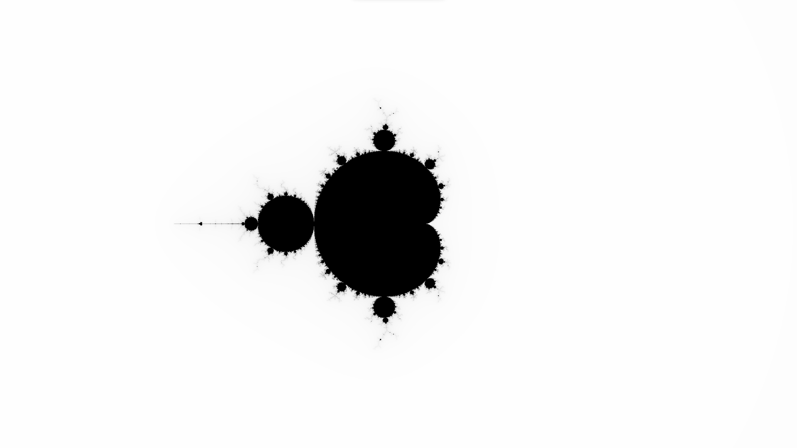
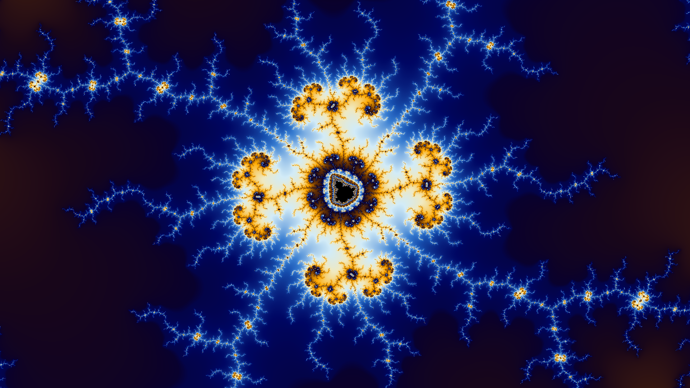
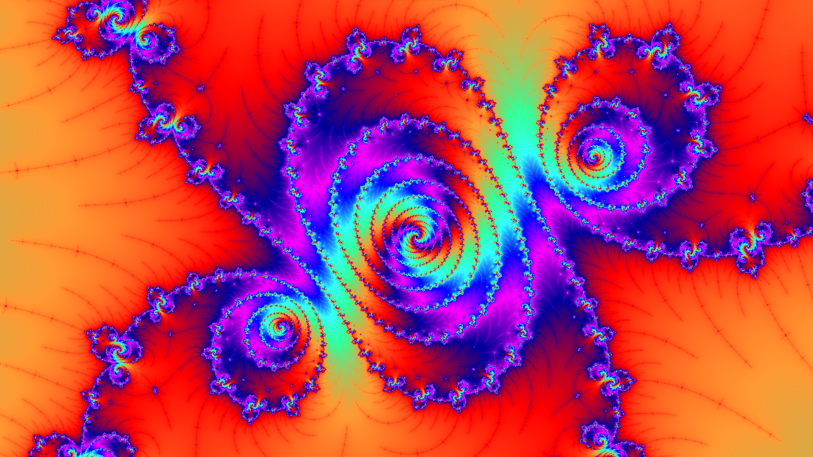
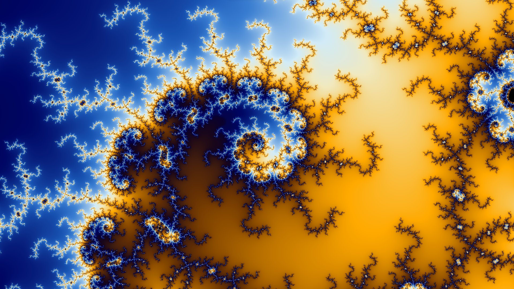
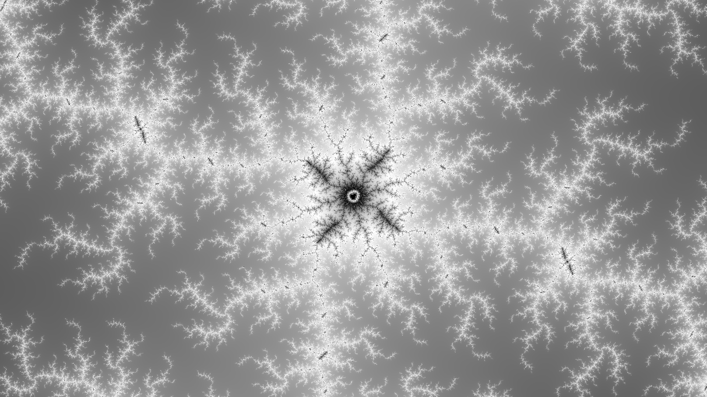
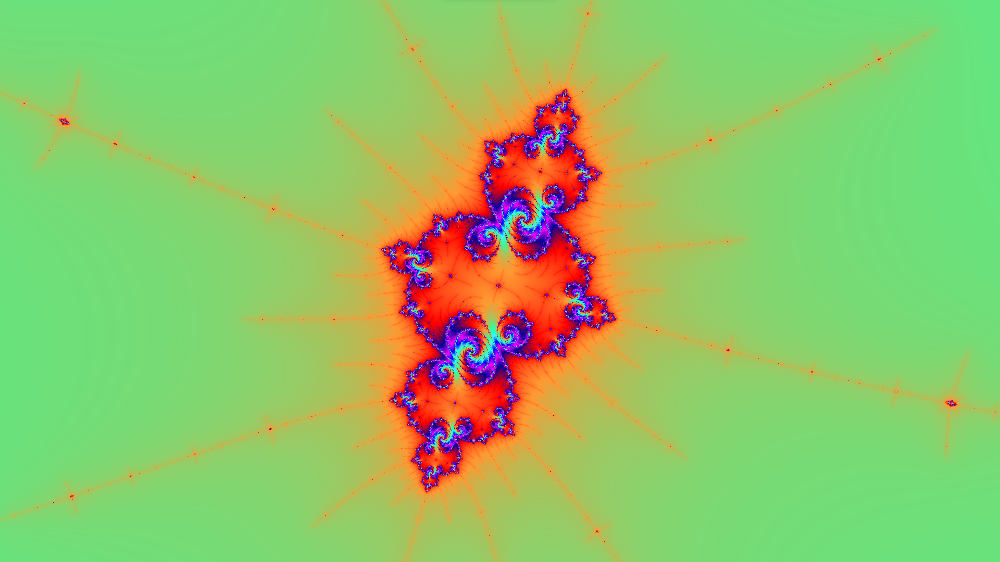
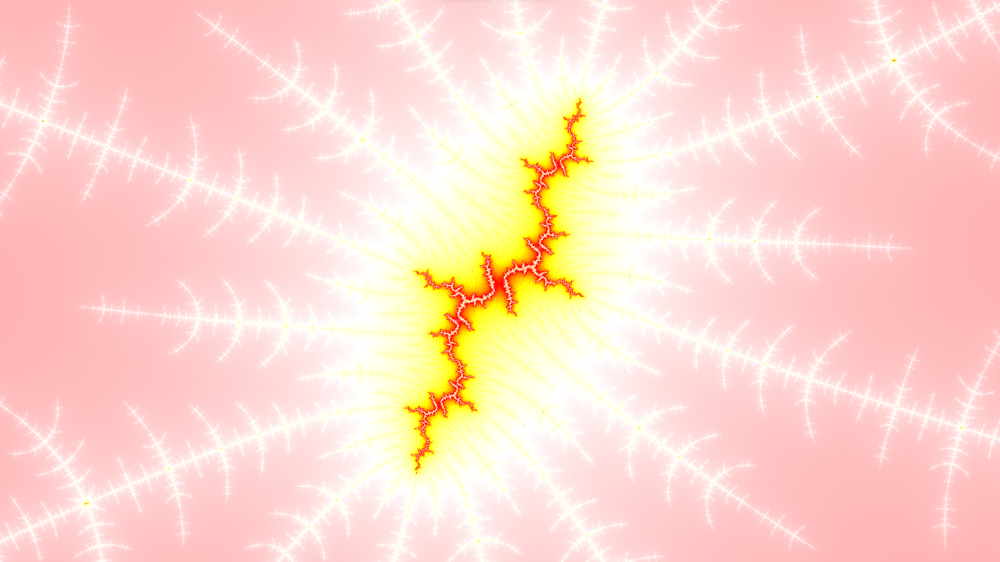

# Mandelbrot fractal explorer

This is a simple Mandelbrot fractal explorer written in V.  

It uses v mandelbrot example base code which can be found [here](https://github.com/vlang/v/blob/master/examples/gg/mandelbrot.v).  

Coloring part is achieved by using linear interpolation on a color palette.  

There is a palette generator, it juste add steps to a color list so the fractal is colored with a gradient.

## Requirements

- [V](https://github.com/vlang/v)

## Usage

```bash
v run mandelbrot.v
```

## Museum

Here are some images generated by the program, there are many more in the `museum` folder.  



  

 

  

  

  



## TODO

- [x] Implement smooth coloring. 

- [x] Translate palette generator from Python to V.

- [ ] Fix zooming (Work well until a certain point, then it starts to glitch).

- [ ] Add GPU support, program is very slow on cpu (I'm not sure if it's possible to do it in V actually).

- [ ] Add direct image saving, generated images in the museum folder are just screenshots.

- [ ] Create other generators, like Julia sets, burning ship or newton fractals.

- [ ] Try other coloring methods, like HSV, LCH, etc.. which can be found [here](https://en.wikipedia.org/wiki/Plotting_algorithms_for_the_Mandelbrot_set).
